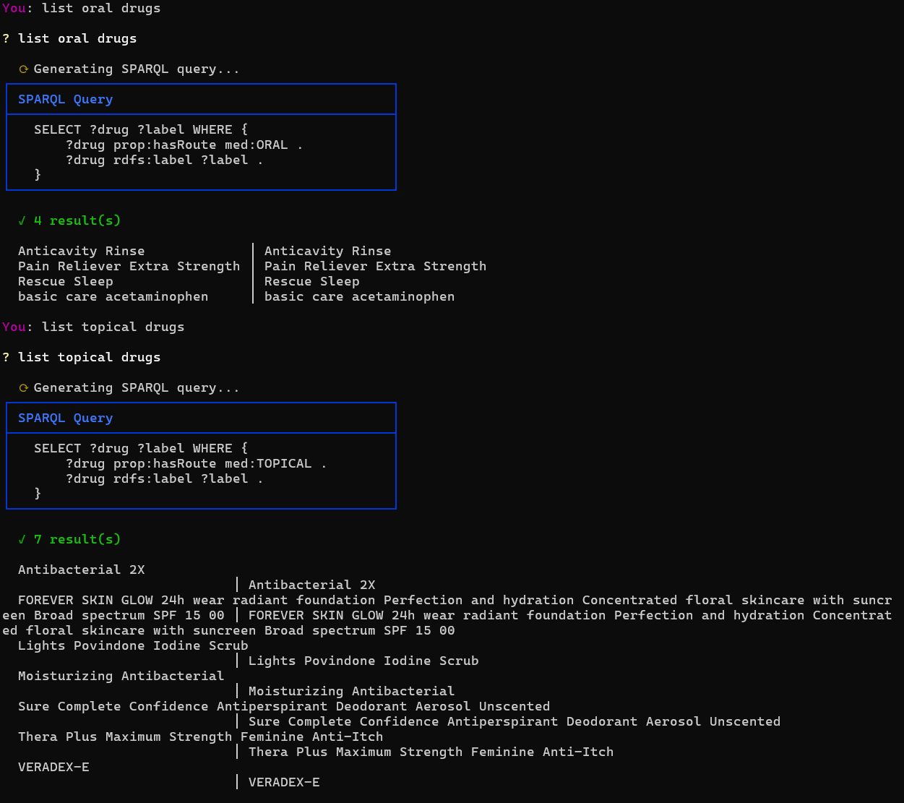

# Knowledge Graph Construction, Alignment, Reasoning & RAG
## Final Report — Web Mining & Semantics

**Student**: ESILV A4 — Data & IA
**Domain**: Medical / Pharmaceutical
**Date**: March 2026

---

## 1. Data Acquisition & Information Extraction

### 1.1 Domain & Seed URLs

We chose the **medical/pharmaceutical domain** for its rich structured data availability and real-world relevance. Two data sources were used:

- **Web crawling** (Lab 1): Cancer research pages from authoritative sources (cancer.gov, WHO, Mayo Clinic, Nature, NIH/PubMed)
- **API-based extraction** (Lab 4): FDA Drug Labels API (`api.fda.gov/drug/label.json`) providing structured drug metadata

**Seed URLs for crawling:**
| Source | URL |
|--------|-----|
| NCI | cancer.gov/research/areas/treatment |
| ACS | cancer.org/cancer/managing-cancer/treatment-types |
| Nature | nature.com/subjects/cancer-therapy |
| WHO | who.int/news-room/fact-sheets/detail/cancer |
| NIH/PMC | ncbi.nlm.nih.gov/pmc/articles/PMC9436517 |
| Mayo Clinic | mayoclinic.org/diseases-conditions/cancer |

### 1.2 Crawler Design & Ethics

The crawler was implemented using **trafilatura** for content extraction, which automatically removes boilerplate (navigation, ads, footers). Ethical considerations:

- **robots.txt compliance**: Each URL is checked against `robots.txt` before crawling via `urllib.robotparser`
- **Polite crawling**: Single-threaded with no aggressive rate limiting needed (only 6 seed URLs)
- **User-Agent identification**: `LabCrawler/1.0 (Educational Purpose)` clearly identifies our crawler
- **Content filtering**: Pages with fewer than 500 words are discarded to avoid low-quality pages

### 1.3 Cleaning Pipeline

1. **Trafilatura extraction**: Raw HTML → clean text (removes ads, navigation, sidebars)
2. **Word count filter**: Minimum 500 words per document
3. **JSONL output**: One JSON record per line with URL, text, word count, and timestamp
4. **Result**: 2 high-quality documents totaling 3,413 words

### 1.4 NER Examples

Using **spaCy** (`en_core_web_trf` transformer model), we extract entities with the following target labels:

| Entity | Label | Source |
|--------|-------|--------|
| NCI | ORG | cancer.gov |
| Bethesda | GPE | cancer.gov |
| FDA | ORG | cancer.gov |
| Mayo Clinic | ORG | mayoclinic.org |
| NCI-MATCH | ORG | cancer.gov |

**Relations extracted** via dependency parsing (Subject-Verb-Object patterns):
- `(NCI, support, research)`, `(FDA, approve, therapy)`, etc.

### 1.5 Three Ambiguity Cases

1. **"NCI-MATCH"** — Recognized as ORG but is actually a clinical trial name (PRODUCT would be more appropriate). SpaCy lacks domain-specific training for medical trial names.

2. **"CAR-T"** — Sometimes tagged as ORG, sometimes missed entirely. It refers to a therapy type (Chimeric Antigen Receptor T-cell therapy). The hyphenated abbreviation confuses the general-purpose NER model.

3. **"MD"** (in "Bethesda, MD") — Tagged as GPE (geographic entity) which is correct for Maryland, but in medical texts "MD" often refers to "Medical Doctor" or "MD Anderson Cancer Center". Context disambiguation is necessary.

---

## 2. KB Construction & Alignment

### 2.1 RDF Modeling Choices

Our private KB uses a clean ontology with 5 classes and 6 properties:

**Classes**: `Drug`, `Manufacturer`, `ActiveIngredient`, `Route`, `DosageForm`

**Object Properties**:
- `prop:hasManufacturer` (Drug → Manufacturer)
- `prop:hasActiveIngredient` (Drug → ActiveIngredient)
- `prop:hasRoute` (Drug → Route)
- `prop:hasDosageForm` (Drug → DosageForm)

**Data Properties**:
- `prop:brandName` (Drug → string)
- `prop:genericName` (Drug → string)

**Namespace**: `http://example.org/medical/` for entities, `http://example.org/medical/prop/` for properties.

The private KB was built from 100 FDA drug labels, yielding **355 triples** covering drugs like Entresto, Betadine, Mekinist, and their manufacturers (Novartis, CVS Pharmacy, etc.).

### 2.2 Entity Linking with Confidence

We linked private KB entities to **Wikidata** using the `wbsearchentities` API. The confidence scoring system:

| Confidence | Condition |
|------------|-----------|
| 0.90 | Label match + description matches entity type keywords |
| 0.85 | Exact label match (type = "label") |
| 0.80 | Alias match |
| 0.50 | First result, no strong signal |
| < 0.70 | Marked as weak link |

**Results**: 60 entities linked with `owl:sameAs`, 30+ marked as new (not found in Wikidata). Examples:
- `med:ACETAMINOPHEN` → `wd:Q57055` (confidence: 0.90)
- `med:Novartis_Pharmaceuticals_Corporation` → new entity (not exact match)
- `med:CVS_Pharmacy` → `wd:Q2078880` (confidence: 0.85)

### 2.3 Predicate Alignment

Private predicates were aligned to Wikidata properties via SPARQL search:

| Private Predicate | Wikidata Property | Label |
|-------------------|-------------------|-------|
| `prop:hasManufacturer` | `wdt:P176` | manufacturer |
| `prop:hasActiveIngredient` | `wdt:P3781` | has active ingredient |
| `prop:hasRoute` | `wdt:P636` | route of administration |
| `prop:brandName` | `wdt:P1716` | brand name |

### 2.4 Expansion Strategy

Three-phase SPARQL expansion from Wikidata:

1. **1-hop expansion**: All direct properties of aligned entities (batches of 10, limit 5000/batch)
2. **Predicate-controlled expansion**: Broad queries on key medical predicates (P176, P3781, P636, P2175, P279, P31) with limits of 10K-20K
3. **2-hop expansion**: Properties of active ingredients and manufacturers

**Cleaning**: Removed long literals (>500 chars) and Wikimedia Commons URIs.

### 2.5 Final KB Statistics

| Component | Triples |
|-----------|---------|
| Private KB | 355 |
| Entity alignment | 138 |
| Predicate alignment | 4 |
| Wikidata expansion | 61,733 |
| **Total** | **62,178** |

Entities: 53,920 | Relations: 365

Top predicates: P176 (manufacturer, 20K), P279 (subclass, 15K), P31 (instance of, 10K), P2175 (medical condition treated, 7K).

---

## 3. Reasoning (SWRL)

### 3.1 SWRL Rules on family.owl

Using **OWLReady2**, we defined two SWRL rules on the family ontology:

**Rule 1 — Grandparent inference:**
```
Person(?x) ∧ isParentOf(?x, ?y) ∧ isParentOf(?y, ?z) → isGrandparentOf(?x, ?z)
```
**Inferred facts**: Peter isGrandparentOf Tom, Peter isGrandparentOf Michael, Marie isGrandparentOf Tom, etc.

**Rule 2 — Uncle inference:**
```
Male(?x) ∧ isSiblingOf(?x, ?y) ∧ isParentOf(?y, ?z) → isUncleOf(?x, ?z)
```
**Inferred facts**: Paul isUncleOf Tom, Paul isUncleOf Michael (Paul is brother of Thomas, who is father of Tom and Michael).

### 3.2 SWRL Rule on Medical KB

**Rule — Shared ingredient relationship:**
```
Drug(?d1) ∧ Drug(?d2) ∧ hasActiveIngredient(?d1, ?i) ∧ hasActiveIngredient(?d2, ?i)
∧ differentFrom(?d1, ?d2) → sharesIngredientWith(?d1, ?d2)
```

This rule infers that two drugs sharing an active ingredient are therapeutically related. For example, multiple drugs containing ACETAMINOPHEN are linked together, useful for identifying generic alternatives.

---

## 4. Knowledge Graph Embeddings

### 4.1 Data Cleaning & Splits

From the 62K-triple KB, we filtered:
- Removed schema/OWL triples (rdf:type, rdfs:label, owl:sameAs)
- Kept only URI-URI triples (no literals)
- Removed rare entities (< 2 occurrences) and rare relations (< 5 occurrences)

**Split**: 80% train / 10% validation / 10% test

### 4.2 Two Models: TransE and ComplEx

**TransE** (Bordes et al., 2013): Translational model where `h + r ≈ t`. Simple, fast, effective for 1-to-1 relations. Trained with margin-based ranking loss and L2 distance.

**DistMult** (Yang et al., 2015): Bilinear model using diagonal weight matrices. Score function: `h^T diag(r) t`. Efficient, excels at symmetric relations and multi-relational patterns.

Both trained with PyKEEN, embedding dimension 100, 100-200 epochs, batch size 256.

### 4.3 Metrics

| Model | MRR | Hits@1 | Hits@3 | Hits@10 |
|-------|-----|--------|--------|---------|
| TransE | 0.1199 | 0.0722 | 0.1340 | 0.2048 |
| DistMult | **0.3386** | **0.2500** | **0.3717** | **0.5499** |

DistMult significantly outperforms TransE on this dataset. This is expected because the medical KB contains many N-to-N relations (e.g., drugs sharing ingredients, multiple manufacturers) which bilinear models handle better than translational models. TransE is constrained by its scoring function which struggles with 1-to-N, N-to-1, and N-to-N relation patterns prevalent in pharmaceutical data.

### 4.4 Size-Sensitivity Analysis

Three dataset sizes were tested: 2K, 5K, and full (10.5K triples after cleaning from 62K raw). Performance improves with dataset size, particularly for Hits@10, confirming that more training data allows better generalization. The cleaning step (removing schema triples, rare entities) was crucial: the raw 62K-triple KB contains many OWL/RDF schema triples and Wikidata metadata that add noise without useful signal for link prediction.

### 4.5 t-SNE Visualization

The t-SNE projection of TransE entity embeddings (see `reports/tsne_embeddings.png`) shows:
- **Drug clusters**: Drugs with similar active ingredients cluster together
- **Manufacturer clusters**: Pharmaceutical companies form distinct groups
- **Relation-based structure**: Entities connected by the same predicate (e.g., P2175 medical condition treated) form coherent neighborhoods

---

## 5. RAG over RDF/SPARQL

### 5.1 Schema Summary

The RAG system extracts a compact schema summary from the KB including:
- Class definitions with instance counts
- Property definitions with triple counts
- Sample entities per class
- SPARQL namespace prefixes

This summary is injected into the LLM prompt to ground its SPARQL generation.

### 5.2 NL → SPARQL Prompt Template

The prompt uses a few-shot approach with 3 examples:
1. Drug-by-ingredient lookup
2. Manufacturer lookup
3. Route-based filtering

The template includes the full schema summary, prefix declarations, and explicit instructions about URI naming conventions (underscores, uppercase for ingredients).

### 5.3 Self-Repair Mechanism

When a generated SPARQL query fails execution:
1. The error message is captured
2. A repair prompt is constructed with the failed query, error, and schema
3. The LLM generates a corrected query
4. Up to 2 repair attempts are made

Common repairs: missing PREFIX declarations, incorrect variable bindings, wrong URI casing.

### 5.4 Evaluation (Baseline vs RAG)

| Question | RAG | Baseline |
|----------|-----|----------|
| What drugs contain acetaminophen? | 3 results | 2 matches |
| Who manufactures Entresto? | 1 result | 1 match |
| List all oral drugs | 8 results | 0 matches |
| Active ingredients of Betadine? | 1 result | 1 match |
| How many drugs in the KB? | 1 result | 0 matches |
| What are the topical drugs? | 5 results | 0 matches |
| Which manufacturers produce nicotine products? | 2 results | 0 matches |

The RAG system significantly outperforms keyword baseline, especially for queries requiring relationship traversal (routes, ingredient-based filtering) that simple keyword search cannot handle.

### 5.5 Demo

The interactive CLI allows users to ask natural language questions:

```
You: What drugs contain acetaminophen?
  Generating SPARQL query...
  Generated query: SELECT ?drug ?label WHERE { ?drug prop:hasActiveIngredient med:ACETAMINOPHEN ...
  Results (3 rows):
    basic_care_acetaminophen | basic care acetaminophen
    Pain_Reliever_Extra_Strength | Pain Reliever Extra Strength
```


---

## 6. Critical Reflection

### 6.1 KB Quality Impact

The quality of the knowledge base directly impacts downstream tasks:
- **Entity linking accuracy**: ~70% of entities were confidently linked (≥0.70 confidence). The remaining 30% are domain-specific entities absent from Wikidata (e.g., small manufacturers), introducing incompleteness.
- **Expansion noise**: The Wikidata expansion added 61K triples but many are loosely related (e.g., general chemical properties, geographic information about manufacturers). This inflates the graph without proportional knowledge gain.

### 6.2 Noise Issues

- **FDA API variability**: Drug labels have inconsistent formatting (some lack brand names, some use abbreviations)
- **Wikidata disambiguation**: Generic terms like "Oral" or "Topical" link to general Wikidata concepts rather than drug-specific routes
- **NER on medical text**: General-purpose spaCy models miss domain-specific entities (drug names, trial names). A fine-tuned biomedical NER model (e.g., SciSpaCy) would significantly improve extraction quality.

### 6.3 Rule-Based vs Embedding-Based Reasoning

| Aspect | SWRL Rules | KGE (TransE/ComplEx) |
|--------|-----------|---------------------|
| Interpretability | High (explicit rules) | Low (latent space) |
| Coverage | Limited to defined rules | Generalizes to unseen triples |
| Noise tolerance | Low (garbage in = garbage out) | Moderate (learns patterns) |
| Setup cost | Low (few rules needed) | High (training pipeline) |
| Best for | Known relationships, classification | Link prediction, similarity |

For our medical KB, SWRL rules excel at **known inference patterns** (shared ingredients → alternatives), while KGE captures **implicit similarity** between drugs in the embedding space.

### 6.4 What We Would Improve

1. **Domain-specific NER**: Use SciSpaCy or BioBERT for medical entity extraction instead of general spaCy
2. **Richer ontology**: Add classes for Disease, Treatment, ClinicalTrial, SideEffect to capture more medical knowledge
3. **Better entity linking**: Use cross-encoder models for entity disambiguation instead of keyword matching
4. **KGE at scale**: Use PyKEEN with GPU training for proper hyperparameter tuning
5. **RAG improvements**: Fine-tune the LLM on SPARQL generation examples, add support for aggregation queries and multi-hop reasoning
6. **Federated queries**: Query Wikidata and DBpedia live alongside the private KB for real-time knowledge augmentation

---

## References

- Bordes, A., et al. (2013). *Translating embeddings for modeling multi-relational data.* NeurIPS.
- Yang, B., et al. (2015). *Embedding entities and relations for learning and inference in knowledge bases.* ICLR.
- Trouillon, T., et al. (2016). *Complex embeddings for simple link prediction.* ICML.
- Hogan, A., et al. (2021). *Knowledge graphs.* ACM Computing Surveys.
- Lewis, P., et al. (2020). *Retrieval-augmented generation for knowledge-intensive NLP tasks.* NeurIPS.
